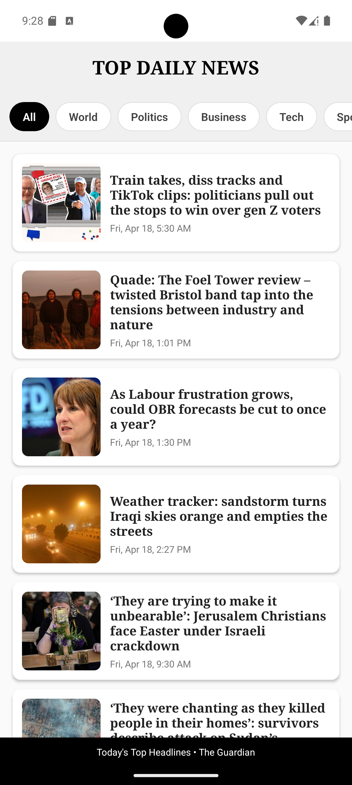

# NewsApp

A modern news application built with React Native (using Expo) and Node.js that allows users to browse, read, and get AI-powered summaries of news articles from The Guardian.

|  |  |  |

## Features

- 📰 Browse top daily news articles from The Guardian API
- 🔍 Filter news by categories (World, Politics, Business, Technology, etc.)
- 📱 Clean, responsive UI with skeleton loading states
- 🔊 Text-to-Speech functionality for article summaries
- 🤖 AI-powered article summarization using Google's Gemini API
- 📑 Article content scraping with cheerio

## Tech Stack

### Frontend (React Native with Expo)
- React Native with TypeScript using Expo framework
- React Navigation for routing
- Expo modules including expo-speech for TTS functionality
- React Native Animated API for loading effects and transitions
- @gorhom/bottom-sheet for the summary modal
- react-native-gesture-handler and react-native-safe-area-context for UI interactions

### Backend (Node.js)
- Express.js server
- Axios for HTTP requests
- Cheerio for HTML parsing and scraping
- Google Gemini API for AI-powered article summarization
- CORS for cross-origin handling

## Getting Started

### Prerequisites
- Node.js (v14+)
- npm or yarn
- Expo Go app installed on your physical device for testing
- Expo CLI: `npm install -g expo-cli` (optional as you can use npx)
- Google Gemini API key
- The Guardian API key

### Installation

1. Clone the repository
```bash
git clone https://github.com/yourusername/news-app.git
cd news-app
```

2. Install dependencies

For the backend:
```bash
cd backend
npm install
```

For the Expo frontend:
```bash
npm install
```

3. Environment setup

Create a `.env` file in the server directory:
```
GEMINI_API_KEY=your_gemini_api_key_here
```

Update the `apiConfig.js` file in the frontend with your Guardian API key.

### Running the app

1. Start the backend server:
```bash
cd backend
npm start
```

2. Start the Expo frontend:
```bash
npx expo start
```

3. Scan the QR code with the Expo Go app on your device, or press 'a' to open in an Android emulator or 'i' for iOS simulator.

## Usage

- When opening the app, you'll see the latest top news from The Guardian
- Use the category buttons to filter news by topic
- Tap on an article to read the full content
- Use the "Summarize" button to get an AI-generated summary of the article
- In the summary view, you can listen to the summary using the text-to-speech functionality
- Adjust the reading speed using the slider control

## API Endpoints

- `GET /api/summarize?url={url}`: Scrapes and summarizes the article at the given URL
- `GET /scrape?url={url}`: Scrapes only the article content without summarization
